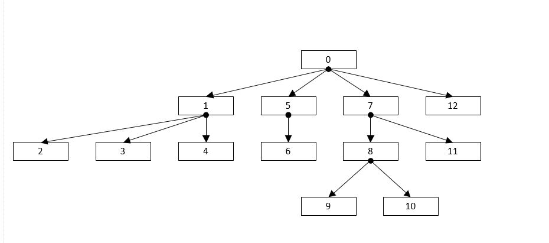
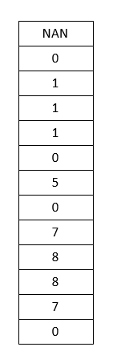
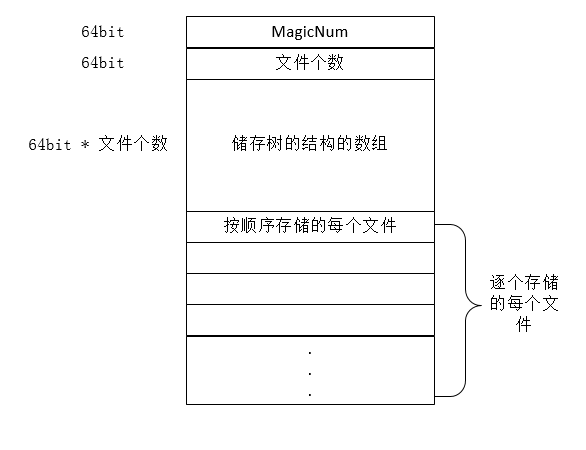
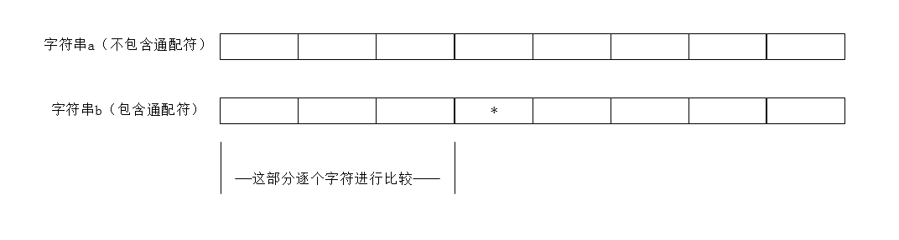
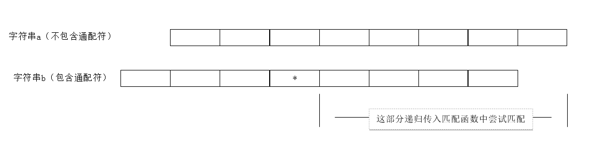
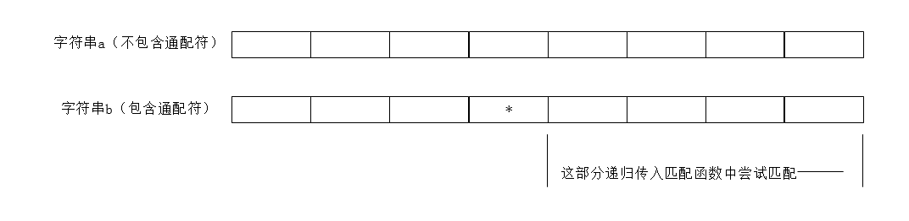
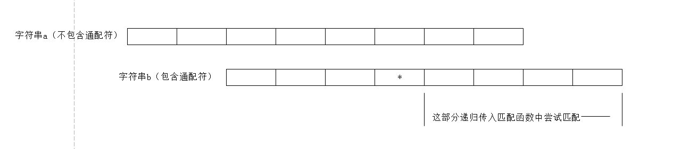

# 详细设计
## 设计目标
使用C++编写一个运行在命令行模式下的，虚拟磁盘的软件。虚拟磁盘软件能够在内存中模拟一个磁盘，通过接受命令，可以在内存中完成一些文件操作的功能。 
### 实现的功能
* 对命令行数据的输入及处理
* 在内存中合理的组织虚拟磁盘的数据结构
* 在内存中完成对硬盘的操作，包括一些需要访问外界非虚拟硬盘的情况
* 完成对虚拟硬盘的序列化及反序列化
### 要求
* 上述功能正确完成
* 无内存泄漏
* 通过测试工具测试
## 设计思路
### 类设计
类图如下：

其中主要的类之间的交互如下：

其中，输入输出，以及对命令行参数的处理由FCommandTool进行，实际的文件操作等，由FVirtualDisk进行。
### 数据结构组织
依赖于FDirectory类，通过树状结构组织文件，并在FVirtualDisk中存储一个FDirectory类的根节点，作为树的根节点。
### 算法应用
#### 存储及加载

* 存储
  
假定原文件树结构如下，则可对每个文件，可以按照遍历顺序对每个节点进行编号

则可以通过数组的形式简单地存储树的拓扑结构，其中每个节点的编号对应数组的下标，可以看到数组中每个元素的值都对应每个节点的父目录的编号

而后，在存储上面所述的数组至文件中后，仅需按照与上面相同的遍历顺序对文件树进行遍历，并逐个存入到磁盘中即可，存储后的文件结构如下

* 加载

首先读取之前所储存的数组（tree），而后创建于此数组长度相同的FFile*类型数组（files），而后逐个读取存储于硬盘上的文件节点，并还原为内存中相应的对象，并将指针存储于files中，而后通过files[tree[i]]即可找到每个文件所对应的父目录，即可还原整个文件树的拓扑结构

由于是先根遍历，所以父节点一定会先于子节点被读取，不会存在访问到尚未加载的对象的情况
***

·

    //创建表示树结构的数组
    /*eg:
        std::vector<uint64_t> tree;
	    tree.push_back(UINT64_MAX);
	    __BuildTopology(mRoot, 0, tree);*/
    void FVirtualDisk::__BuildTopology(FDirectory * _node, uint64_t _parrentIndex, std::vector<uint64_t>& _treeArray)
    {
    	for (auto _ele : _node->GetSubFiles())
    	{
    		if (_ele->GetFileType() == EFileType::Directory)
	    	{
		    	_treeArray.push_back(_parrentIndex);
    			__BuildTopology(dynamic_cast<FDirectory*>(_ele), _treeArray.size() - 1, _treeArray);
    		}
	    	else
		    {
    			_treeArray.push_back(_parrentIndex);
	    	}
    	}
    }

    //加载
    uint64_t FVirtualDisk::Load(FDirectory *& _currentDir, const FPath & _source)
    {
	    std::vector<uint64_t> tree;
    	std::vector<FFile*> files;
    
       std::ifstream ifs(_source.ToString(false), std::ios::in | std::ios::binary);
    	if (ifs.is_open() == false) return E_ACCESS_FAILURE_ERROR;

    	uint64_t magicNum = 0;
    	ifs.read(reinterpret_cast<char*>(&magicNum), sizeof(uint64_t));
    	if (magicNum != 1014931172) return E_NOT_VALID_VIRTUAL_DISK_FILE_ERROR;
    	uint64_t fileCount = 0;
    	ifs.read(reinterpret_cast<char*>(&fileCount), sizeof(uint64_t));
    	tree.resize(fileCount);
	    ifs.read(reinterpret_cast<char*>(&tree[0]), sizeof(uint64_t) * fileCount);

        //LoadRootFile

	    files.resize(fileCount, nullptr);
	    files[0] = mRoot;

	    for (uint64_t i = 1; i != fileCount; ++i)
	    {
            //LoadFile
            files[i] = newFile;
	    	dynamic_cast<FDirectory*>(files[tree[i]])->AddSubFile(files[i]);
	    }
	    return E_OK;
    }
·

#### 命令行数据的解析

这里的主要作用是将命令行字符串解析为其中的多个参数以及路径，命令等不同部分
其分割的规则为，每一部分之间通过空格进行分割，除非有一部分，其中存在双引号，那么在遇到与之匹配的双引号前，即使存在空格，也不会将之视为不同部分。
在进行分割时，首先跳过所有空格，而后存储当前的迭代器（begin），并设置flag，每次当遇到双引号时，将flag取反，然后逐个遍历传入的命令行字符串，当同时满足flag为true，且当前字符为空格时，停止遍历，将begin到现在的迭代器中间的所有字符在剔除"后，作为拆分后的命令行的一部分

·
	std::vector<std::string> SplitCmdLine(std::string _cmdLine)
	{
		std::vector<std::string> cmdLines;
		bool isInDoubleQuotes = false;
		bool IsMatching = false;
	
		for (auto it = _cmdLine.begin(); it != _cmdLine.end(); NULL)
		{
			for (NULL; it != _cmdLine.end() && *it == L' '; ++it);
			if (it == _cmdLine.end()) break;
	
			auto begin = it;
	
			bool isInDoubleQuotes = false;
	
			for (NULL; it != _cmdLine.end(); ++it)
			{
				if (*it == '\"')
					isInDoubleQuotes = !isInDoubleQuotes;
				if (!isInDoubleQuotes && *it == ' ')
					break;
	
			}
			if (begin == it)
				continue;
			else
			{
				std::string str(begin, it);
				for (auto it = str.begin(); it != str.end(); NULL)
				{
					if (*it == '\"')
						it = str.erase(it);
					else
						++it;
				}
				cmdLines.push_back(std::move(str));
				if (it == _cmdLine.end()) break;
				else ++it;
			}
		}
		return std::move(cmdLines);
	}
·

####  带通配符的字符串匹配
当对字符串a（不包含通配符），b（包含通配符）进行匹配时，在遇到 * 号前仅需逐个字符进行匹配即可，遇到 ? 可以直接判断为真，并跳过

当遇到*运算符后，可将字符串b中的 * 通配符跳过，并尝试逐步将a字符串中跳过n(n >= 0)个字符后的剩余内容与b字符串中 * 后的内容进行匹配

*第一次：

若匹配失败，则分别进行多次匹配，如下

直到成功为止，若均匹配失败，则说明两个字符串并不匹配
`

	bool IsMatch(Comment(without * and ? ) const std::string & _str1, Comment(with * and ? ) const std::string & _str2)
	{
		auto it1 = _str1.begin(), it2 = _str2.begin();
		for (NULL; it1 != _str1.end() && it2 != _str2.end(); NULL)
		{
			if (*it1 == *it2 || *it2 == '?')
			{
				++it1, ++it2;
				continue;
			}
	
			if (*it2 == '*')
			{
				if (++it2 == _str2.end()) return true;
	
				std::string restString2(it2, _str2.end());
				for (auto tempit1 = it1; tempit1 != _str1.end(); ++tempit1)
				{
					if (IsMatch(std::string(tempit1, _str1.end()), restString2)) return true;
				}
				return false;
			}
			return false;
		}
	
		bool flag = it2 != _str2.end();
	
		while (it2 != _str2.end() && *it2 == '*') ++it2;
	
		return (flag || it1 == _str1.end()) && it2 == _str2.end();
	}
`