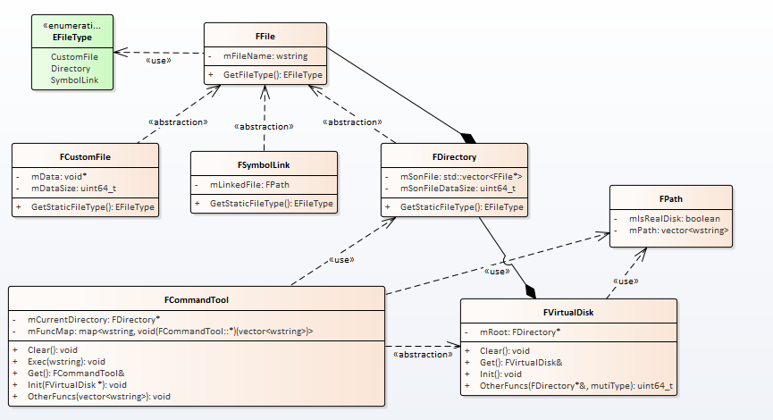
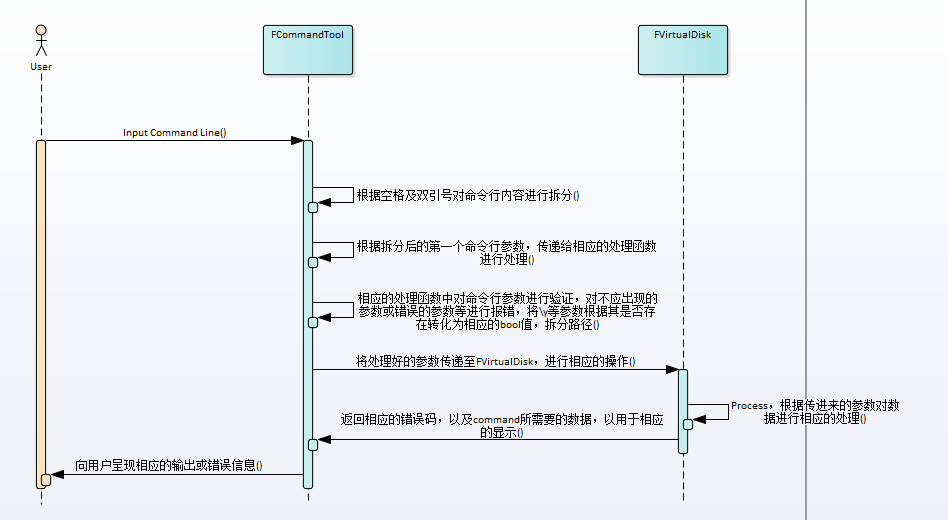

# 详细设计
## 设计目标
使用C++编写一个运行在命令行模式下的，虚拟磁盘的软件。虚拟磁盘软件能够在内存中模拟一个磁盘，通过接受命令，可以在内存中完成一些文件操作的功能。 
### 实现的功能
* 对命令行数据的输入及处理
* 在内存中合理的组织虚拟磁盘的数据结构
* 在内存中完成对硬盘的操作，包括一些需要访问外界非虚拟硬盘的情况
* 完成对虚拟硬盘的序列化及反序列化
### 要求
* 上述功能正确完成
* 无内存泄漏
* 通过测试工具测试
## 设计思路
### 类设计
类图如下：

其中主要的类之间的交互如下：

其中，输入输出，以及对命令行参数的处理由FCommandTool进行，实际的文件操作等，由FVirtualDisk进行。
### 数据结构组织
依赖于FDirectory类，通过树状结构组织文件，并在FVirtualDisk中存储一个FDirectory类的根节点，作为树的根节点。
### 算法应用
* 序列化及反序列化

*根据虚拟磁盘中的文件，文件夹，链接数量创建整形数组，并按照树的先根顺序进行遍历，其中每个节点的遍历顺序即对应数组中的索引，并在其所对应的数组元素中存储该节点的父节点所对应的索引，便可存储虚拟磁盘中的文件结构，在将数组存储至硬盘中后，将虚拟磁盘中的每个文件文件夹等按照与之前一致的遍历顺序进行遍历，并逐个将其进行序列化即可。*

*读取时，先读取出之前所存储的整形数组，并创建于整形数组长度相当的FFile\*数组，而后逐个读取存储于硬盘中的虚拟磁盘中的文件等，并存储于数组中，同时，可以通过整形数组中的索引，找到每个文件，文件夹的父目录的对象指针，重新构建虚拟磁盘中的树状结构*

### 细节
* 链接文件中直接存储相应的无链接的绝对路径。

